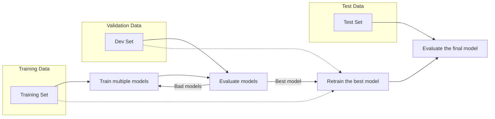

#Type of Sets
> **Training Set:**  
> The training set is a subset of data used to fit and train a machine learning model. It may be labled or not depend on the type of learning used.  
>- Holds approximately 60–80% of the data  
>- Represents the general problem being addressed   
>- might be allot of noise in the data   

>**Train-dev set:**
>The dev set is an extra tool to see if the training set hit the mark. If the model preformence is poor then it must have overfitted the training set.
if it preforms well on the train-dev we cant try evalute it on the dev set. 
>

>**Dev set(validation):**
>This is the set used during develompent to choose the best model or hpyerparameters we want to use and it give an estamation of how well will the model work on unseen but representive data.

>**Test set:**
>The final evaluation of the model, it's used to estimate how well the modell will preform on real world data we evaluate it once at the end and thats it.  
Data must be representive of the production data. meaning the test set should be similiar in type and quality to the data the model will meet in the real world when deployed.

---

## 🧠 Final Analogy

Imagine you're training for a marathon:

- 🏋️ **Training set:** Your daily practice runs where you build up your skills and stamina.
- 🧪 **Train-dev set:** A practice race on a course similar to the real one, helping you check if your training is on track.
- 🧪 **Dev set:** A practice race on the actual marathon course, letting you fine-tune your strategy and gear.
- 🏁 **Test set:** The real marathon at the end, where you see how well all your preparation pays off.

## A general idea of the stages
